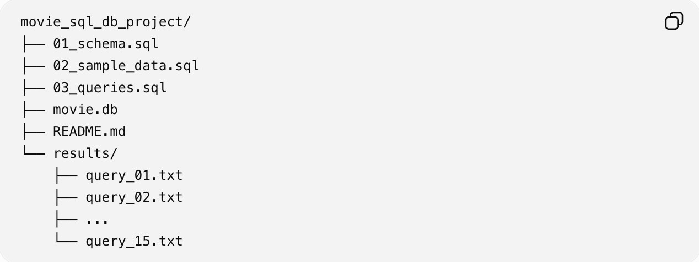

# 1. 주제
## 내가 본 영화 정보를 데이터베이스에 저장하는 프로그램

# 2. 사용 환경
## 1) DB : SQLite
## 2) SQL 실행 도구 :SQKite CLI

# 3. 테이블
##  - user : 사용자 정보 (id, name)
##  - movie : 영화 번호, 영화 제목, 개봉 연도, 상영시간, 내가 본 날짜, 장르 번호
##  - genre : 장르 종류, 종류별 부여된 번호
##  - review : 내가 본 영화 번호, 영화 번호에 대응하는 평점

# 4. 관계
## - genre 1 : N movie
## - user 1: N movie
## - movie 1: N review

# 5. 파일 실행 순서
## 1) 01_schema.sql
## 2) 02_sample_data.sql
## 3) queries.sql

# 6. SQLite CLI 실행 예시

## sqlite3 movie.db

## SQLite 화면에서:

## .read 01_schema.sql
## .read 02_sample_data.sql
##  .read 03_queries.sql

## 종료:

## .quit

# 7. FK 확인
## SQLite는 연결마다 FK 기능을 켜야 하므로 SQL 파일에 다음 구문을 추가
## **PRAGMA foreign_keys = ON;**
## 없는 user_id 또는 movie_id를 review에 넣으려고 하면 FK 오류가 발생함

# 8. 제약조건
## - NOT NULL: 필수값 입력
## - UNIQUE: username, genre_name, (user_id, movie_id)
## - CHECK: 개봉 연도, 러닝타임, 평점 범위
## - FOREIGN KEY: 테이블 사이의 관계 보장

# 9. 핵심 SQL (내용, 사용 sql)
## 2020년 이후 영화	/ WHERE
## 러닝타임 순 정렬	/ ORDER BY
## 9점 이상 리뷰 / WHERE, ORDER BY
## 최근 영화 5개 / LIMIT
## 영화 + 장르 / INNER JOIN
## 사용자 + 리뷰 + 영화 / INNER JOIN
## 모든 영화 + 리뷰 수	/ LEFT JOIN
## 사용자 + 영화 + 장르 + 평점	/ 다중 JOIN
## 장르별 영화 수	/ COUNT, GROUP BY
## 영화별 평균 평점 / AVG, GROUP BY
## 사용자별 평점 합계 / SUM, COUNT, GROUP BY
## 전체 평균보다 높은 리뷰	/ 서브쿼리
## 영화 제목 인덱스 / CREATE INDEX
## 시청 날짜 변경	/ UPDATE
## 리뷰 삭제 / DELETE

# 10. 프로젝트 구조
